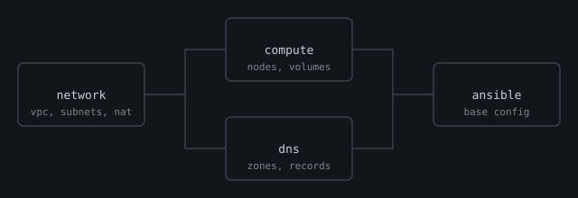

# Infrastructure

Everything needed to stand up a small production environment from nothing: the network, the nodes and the base configuration on each node.



## Layout

| Path | What lives there |
|---|---|
| [`terraform/`](terraform/main.tf) | Network, compute and DNS, split into modules |
| [`ansible/`](ansible/site.yml) | Base configuration applied to every node |
| [`scripts/`](scripts/bootstrap.sh) | One-off helpers for bootstrapping state |

## Usage

```bash
make init      # configure the remote state backend
make plan      # show what would change
make apply     # apply after review
```

Every pull request runs `terraform plan` in CI and posts the diff as a comment, so changes are reviewed as infrastructure diffs, not just code diffs.

## Design notes

- **State is remote and locked.** Two people applying at once is the most common way to corrupt state.
- **Modules are small.** The network module knows nothing about compute; outputs are the only contract between them.
- **Nodes are cattle.** Ansible is idempotent and runs on every boot, so a rebuilt node converges to the same state.
